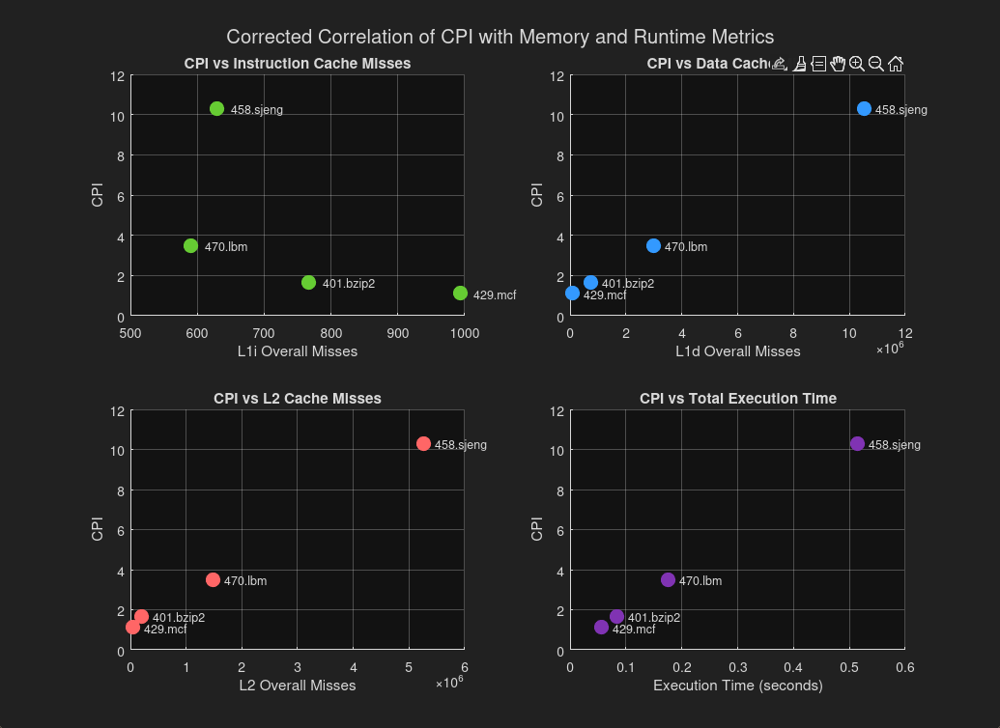
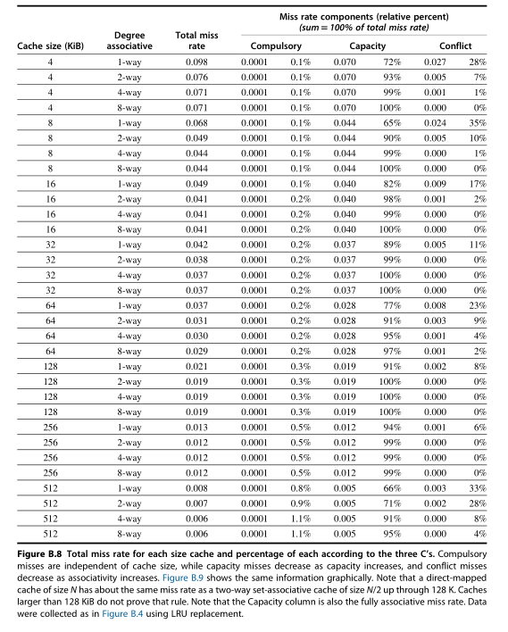
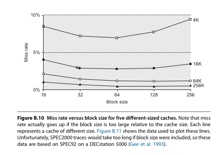
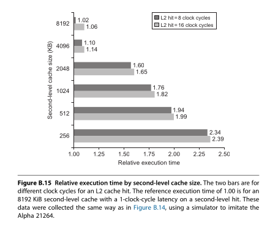
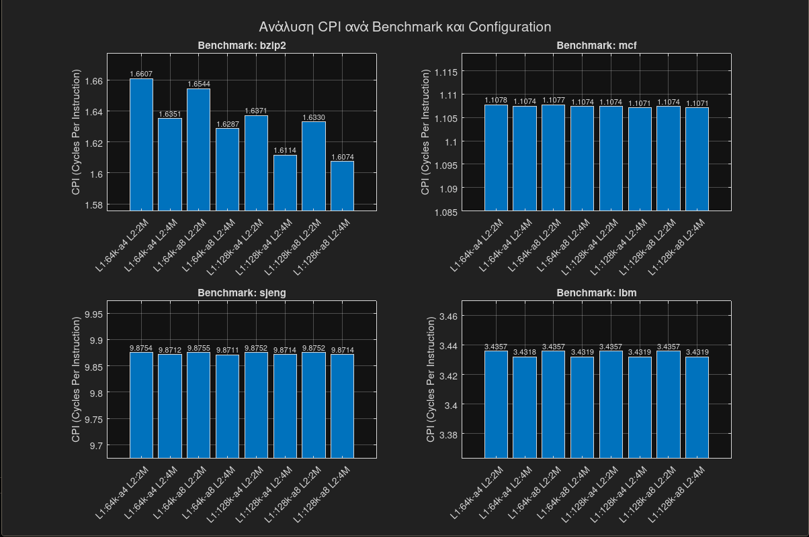
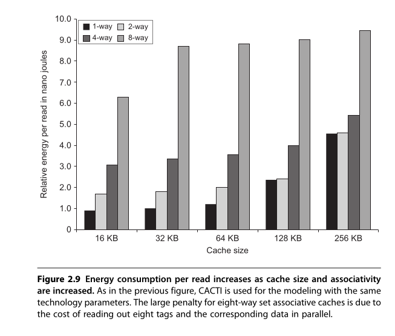

# Προαιρετική Εργασία - Εισαγωγή στον Εξομοιωτή gem5

## ΜΕΡΟΣ ΠΡΩΤΟ

### 1. Βασικές Παράμετροι Συστήματος (starter_se.py)
Με βάση το αρχείο `starter_se.py` και το input argument που χρησιμοποιήθηκε, μπορούμε να καταλάβουμε ότι από τα τρία είδη CPU χρησιμοποιήθηκε το **"minor"** (`--cpu=minor`) με τα εξής χαρακτηριστικά:

* **CPU:** MinorCPU (In-order).
* **Πυρήνες:** 1 (default).
* **Συχνότητα Συστήματος:** 1GHz (`clock="1GHz"`).
* **Συχνότητα CPU:** 4GHz (default).
* **Caches:** Τρία επίπεδα. L1I και L1D για κάθε πυρήνα (εδώ δεν αλλάζει κάτι γιατί έχουμε εναν) και L2 κοινή (`"minor": (MinorCPU, devices.L1I, devices.L1D, devices.L2)`).
* **Cache Line Size:** 64 bytes.
* **Μνήμη:** DDR3_1600_8x8, μέγεθος 2 GB.

### 2.a Αρχεία Config και Stats
Επαλήθευση παραμέτρων από τα αρχεία `config.ini` και `config.json`:

* **CPU:** `[system.cpu_cluster.cpus] type=BaseMinorCPU`, `"cpus": ["numThreads": 1]`.
* **Ρολόι:** `[system.clk_domain] clock=1000` (1GHz) και `[system.cpu_cluster.clk_domain] clock=250` (4GHz - περίοδος σε ps).
* **Μνήμη:** `"mem_ranges": ["0:2147483648"]` (2GB), `cache_line_size: 64`.

### 2.b Ορισμοί Μετρήσεων
* **simSeconds:** Ο αριθμός των δευτερολέπτων που εξομοιώθηκαν (Second).
* **simTicks:** Ο αριθμός των ticks που εξομοιώθηκαν (Tick).
* **simInsts:** Ο αριθμός των εντολών που εξομοιώθηκαν (Count).
* **hostInstRate:** Ο ρυθμός εκτέλεσης εντολών του εξομοιωτή (Count/Second).

### 2.c Committed Instructions vs Ops
* **Committed Instructions:** 5034
* **Committed Ops:** 5841

Το γεγονός ότι υπάρχουν 5841 Ops για 5034 Insts σημαίνει ότι περίπου το 16% των εντολών του "Hello World" ήταν αρκετά σύνθετες (micro-ops) ώστε να χρειαστούν παραπάνω από ένα βήμα στο pipeline του MinorCPU.

#### 2.d Προσπελάσεις Cache (L1 & L2)
Ο υπολογισμός των συνολικών προσπελάσεων γίνεται ως άθροισμα Hits + Misses:
* **L1:** 179 (misses) + 1990 (hits) = **2169** overall accesses.
* **L2:** **480** overall accesses.

---

### 3. Μοντέλα CPU & Σύγκριση Απόδοσης

#### Περιγραφή Μοντέλων In-Order
1.  **AtomicSimpleCPU:** Το πιο απλό μοντέλο. Εκτελεί κάθε εντολή σε ένα tick χρησιμοποιώντας ακαριαίες προσβάσεις μνήμης. Κατάλληλο μόνο για γρήγορο simulation, όχι για χρονομέτρηση.
2.  **TimingSimpleCPU:** Μοντέλο μέσης λεπτομέρειας. Δεν έχει pipeline, αλλά υπολογίζει τις καθυστερήσεις (latencies) του συστήματος μνήμης.
3.  **MinorCPU:** Το πιο λεπτομερές in-order μοντέλο με pipeline 4 σταδίων (Fetch1, Fetch2, Decode, Execute). Μοντελοποιεί εξαρτήσεις δεδομένων.

#### Αποτελέσματα Κώδικα C (Άθροισμα 1..N)

Ο κώδικας C μπορεί να βρεθει στο αρχείο C/Nsum.c

| Στατιστικό | TimingSimpleCPU | MinorCPU |
| :--- | :--- | :--- |
| **simSeconds** | 0.000045 s | 0.000041 s |
| **simTicks** | 45,254,000 | 40,942,000 |
| **simInsts** | 9,025 | 9,097 |

#### Επίδραση Παραμέτρων (Scaling)
* **Αύξηση Συχνότητας CPU:**
    * *MinorCPU:* Μείωση του `simSeconds`, αλλά αύξηση του CPI λόγω Memory Wall (ο επεξεργαστής περιμένει τη μνήμη).
    * *TimingSimple:* Γραμμική μείωση χρόνου, αλλά και πάλι εμφανίζεται καθυστέρηση μνήμης.
* **Ταχύτερη Μνήμη (DDR4 vs DDR3):**
    * Μείωση του `simSeconds` και στα δύο μοντέλα.
    * Μείωση του CPI (λιγότερα stalls).

---

## ΜΕΡΟΣ ΔΕΥΤΕΡΟ

### 1. Παράμετροι Υποσυστήματος Μνήμης
* **L1 Instruction:** 32kB, 2-way associativity.
* **L1 Data:** 64kB, 2-way associativity.
* **L2 Cache:** 2MB, 8-way associativity.
* **Cache Line:** 64 bytes.
* **Κύρια Μνήμη:** DDR3_1600_8x8, χωρητικότητα 512MB (536870912 bytes).

### 2. Αποτελέσματα Benchmarks (Base Configuration)

| Benchmark | Χρόνος (s) | CPI | L1i Miss Rate | L1d Miss Rate | L2 Miss Rate | Ins. count |
| :--- | :--- | :--- | :--- | :--- | :--- | :--- |
| **401.bzip2** | 0.0839 | 1.68 | 0.000075 | 0.014293 | 0.294693 | 100000000 |
| **429.mcf** | 0.0554 | 1.11 | 0.000037 | 0.002062  | 0.727975 | 100000000 |
| **458.sjeng** | 0.5140 | 10.30| 0.000020 | 0.121829 | 0.999979 | 100000000 |
| **470.libm** | 0.1750 | 3.50 | 0.000098 | 0.060971 | 0.999927 | 100000001 |

*Παρατήρηση: Το CPI συσχετίζεται άμεσα με τα Miss rates. Όσο μεγαλύτερα τα misses (ειδικά στην L2), τόσο αυξάνεται το CPI.*

Ο κώδικας του γραφίματος μπορεί να βρεθει στο αρχείο matlab/CPIvsall.m

### 3. Scaling Συχνότητας (1GHz vs 4GHz)

**Αποτελέσματα στα 1GHz:**

| Benchmark | Χρόνος (s) | CPI | L1i Miss Rate | L1d Miss Rate | L2 Miss Rate | Ins. count |
| :--- | :--- | :--- | :--- | :--- | :--- | :--- |
| **401.bzip2** | 0.0839 | 1.68 | 0.000075 | 0.014293 | 0.294693 | 100000000 |
| **429.mcf** | 0.0554 | 1.11 | 0.000037 | 0.002062  | 0.727975 | 100000000 |
| **458.sjeng** | 0.5140 | 10.30| 0.000020 | 0.121829 | 0.999979 | 100000000 |
| **470.libm** | 0.1750 | 3.50 | 0.000098 | 0.060971 | 0.999927 | 100000001 |

**Αποτελέσματα στα 4GHz:**
| Benchmark | Χρόνος (s) | CPI | L1i Miss Rate | L1d Miss Rate | L2 Miss Rate | Ins. count |
| :--- | :--- | :--- | :--- | :--- | :--- | :--- |
| **401.bzip2** | 0.045619| 1.824753 | 0.000075 | 0.014400 | 0.294706 | 100000000 |
| **429.mcf** | 0.028586 | 1.143455| 0.000037 | 0.002062  | 0.727975 | 100000000 |
| **458.sjeng** | 0.417843 | 16.713708| 0.000020 | 0.121829 | 0.999979 | 100000000 |
| **470.libm** | 0.132695 | 5.307798 | 0.000098 | 0.060971 | 0.999927 | 100000001 |

**Παρατηρήσεις:**
Η ανάλυση των αποτελεσμάτων αποκαλύπτει ότι η αύξηση της συχνότητας λειτουργίας από το 1GHz στα 4GHz δεν οδηγεί σε γραμμική βελτίωση της απόδοσης (τέλειο scaling), φαινόμενο που αποδίδεται στον περιορισμό του «Memory Wall». Ενώ ο επεξεργαστής χρονίζεται 4 φορές ταχύτερα, η ταχύτητα της κύριας μνήμης παραμένει σταθερή, με αποτέλεσμα την κατακόρυφη αύξηση του CPI, ιδιαίτερα σε benchmarks όπως το **458.sjeng** και το **470.libm** που παρουσιάζουν L2 Miss Rate σχεδόν 1.0. Σε αυτά τα «Memory Bound» workloads, ο επεξεργαστής αναλώνει το μεγαλύτερο μέρος των κύκλων του σε καταστάσεις αναμονής (stalls) για δεδομένα από τη RAM. Αντίθετα, η αναβάθμιση σε μνήμη **DDR3_2133** επιτυγχάνει μείωση του χρόνου εκτέλεσης και του CPI, καθώς η μείωση του χρόνου κύκλου (`tCK`) από τα 1250ps στα 938ps επιταχύνει την απόκριση του συστήματος μετά από L2 misses. Η βελτίωση αυτή είναι αισθητή μόνο στα ενεργοβόρα ως προς τη μνήμη benchmarks, ενώ παραμένει αμελητέα σε «Cache Friendly» περιπτώσεις όπως το **429.mcf**, όπου το εξαιρετικά χαμηλό L1d Miss Rate (~0.2%) επιτρέπει την εξυπηρέτηση των περισσότερων αναγκών εντός του επεξεργαστή.

### 4. Αλλαγή Μνήμης (DDR3_1600 -> DDR3_2133)
Με τη χρήση της ταχύτερης μνήμης DDR3_2133:
| Benchmark | Χρόνος (s) | CPI | L1i Miss Rate | L1d Miss Rate | L2 Miss Rate | Ins. count |
| :--- | :--- | :--- | :--- | :--- | :--- | :--- |
| **401.bzip2** | 0.045245| 1.809803 | 0.000075 | 0.014398 | 0.294707 | 100000000 |
| **429.mcf** | 0.028526 | 1.141057 | 0.000037 | 0.002062  | 0.727975 | 100000000 |
| **458.sjeng** | 0.399930| 15.997216 | 0.000020 | 0.121829 | 0.999979 | 100000000 |
| **470.libm** | 0.127128 | 5.085129 | 0.000098 | 0.060971 | 0.999927 | 100000001 |

**Τεχνική Ανάλυση Μετάβασης Μνήμης (DDR3_1600 ->  DDR3_2133)**

Η μετάβαση από τη μνήμη DDR3_1600 στην ταχύτερη DDR3_2133 επιφέρει ορατή αλλά μη γραμμική βελτίωση στις επιδόσεις του συστήματος. Η μείωση του συνολικού χρόνου εκτέλεσης (`sim_seconds`) και του δείκτη CPI οφείλεται στην αύξηση του διαθέσιμου εύρους ζώνης (bandwidth) από τα 800 MHz στα 1066 MHz και στη μείωση του χρόνου κύκλου ρολογιού (`tCK`) από τα 1250 ps στα 938 ps. Ο επεξεργαστής MinorCPU, λόγω της in-order αρχιτεκτονικής του, "παγώνει" (stalls) λιγότερο χρόνο περιμένοντας δεδομένα από την κύρια μνήμη μετά από μια αστοχία στην L2 cache. 

Η βελτίωση αυτή είναι ιδιαίτερα αισθητή στο benchmark **458.sjeng** (μείωση χρόνου από 0.417s σε 0.399s), το οποίο χαρακτηρίζεται από πολύ υψηλό L2 Miss Rate, ενώ παραμένει οριακή στο **429.mcf**, όπου η πλειονότητα των προσπελάσεων εξυπηρετείται από τις προσωρινές μνήμες (cache hits). Το γεγονός ότι η βελτίωση δεν είναι ανάλογη της αύξησης της συχνότητας (π.χ. 33% ταχύτερη μνήμη δεν αποδίδει 33% ταχύτερο σύστημα) εξηγείται από το ότι η ταχύτητα της RAM επηρεάζει μόνο τις περιπτώσεις L2 misses, ενώ οι πραγματικοί χρόνοι απόκρισης (latencies) σε nanoseconds συχνά παραμένουν παρόμοιοι στις DDR3 τεχνολογίες.

# Στρατηγική Βελτιστοποίησης Συστήματος (Μέρος 2, Ερώτημα 1)

## 1. Στρατηγική Περιορισμού Χώρου Αναζήτησης
Ο χώρος των πιθανών συνδυασμών περιορίστηκε με βάση τους περιορισμούς μεγέθους ($L1_{total} \le 256KB$ και $L2 \le 4MB$) και τις αρχές των Hennessy & Patterson. Οι επιλογές βασίστηκαν στα εξής κριτήρια:

* **Associativity (Συσχετικότητα):** Με βάση το **Figure B.8**, η αύξηση της συσχετικότητας πάνω από 8-way προσφέρει μηδαμινή βελτίωση στο miss rate, ενώ αυξάνει την πολυπλοκότητα και την ενέργεια. Για την L1i επιλέχθηκαν τιμές 1-way και 2-way, λόγου του πολύ χαμηλού miss rate που έχει ούτοσι άλλος ενώ για την L1d επιλέχθηκαν τιμές 4-way και 8-way, καθώς η υπάρχουν αρκετές αστοχίες στα benchmarks που ήδη δοκιμάστηκαν (ειδικα στο **458.sjeng** που φτάνει στο 0.121829). Για την L2 επιλέχθηκε 8-way λόγου του απαγορευτικού κόστους αστοχίας.

* **Cache Line Size:** Επιλέχθηκε η σταθερή τιμή των **64 bytes**. Σύμφωνα με το **Figure B.10**, μικρότερα μεγέθη (π.χ. 32B) δεν εκμεταλλεύονται το spatial locality, ενώ μεγαλύτερα (128B+) αυξάνουν το miss penalty και μπορεί να προκαλέσουν cache pollution. Το μόνο λογικό μπλοκ size με οποιοδήποτε configuration όπως δείχνει το σχήμα.
  

* **Μέγεθος Caches:** Με . Για την L2, οι δοκιμές επικεντρώθηκαν στα 2MB και 4MB, καθώς το **Figure B.15** δείχνει ότι μικρότερα μεγέθη αυξάνουν εκθετικά τον σχετικό χρόνο εκτέλεσης.

## 2. Ανάλυση Αποτελεσμάτων (CPI_Final_Results)

**Απαραίτητα διευκρίνιση:** Αναγνωρίζουμε ότι το gem5 δεν προσαρμόζει αυτόματα το Latency (σε κύκλους) όταν αυξάνεται το μέγεθος της cache. Συνεπώς, η μείωση του CPI στις μεγαλύτερες L1 caches (128KB) ενδέχεται να είναι υπεραισιόδοξη, καθώς σε πραγματικό υλικό η προσπέλαση θα απαιτούσε περισσότερους κύκλους ρολογιού. Γι αυτό και δοκιμάστηκαν L1 μεγαλύτερης συσχετικότητας απότι φαίνεται λογικό. Η συνάρτηση κόστους στην επόμενη ενότητα προσπαθεί να εξησοροπήσει αυτό το γεγονός.

Από τις δοκιμές με τους διάφορους συνδυασμούς παραμέτρων, προκύπτουν τα εξής συμπεράσματα:

Ο κώδικας του γραφίματος μπορεί να βρεθει στο αρχείο matlab/CPItestbench.m

Τα Raw δεδομένα μπορούν να βρεθούν στο CPI_Final_Results.txt

### Α. Επίδραση του Μεγέθους L2
Σε όλα τα benchmarks, η αύξηση της L2 από 2MB σε 4MB προσφέρει τη σταθερότερη μείωση στο CPI:
* **401.bzip2:** Το CPI μειώνεται από **1.6607** (2MB) σε **1.6350** (4MB).
* **458.sjeng:** Παρόλο που παραμένει Memory Bound (υψηλό CPI ~9.87), η L2 των 4MB επιτυγχάνει το ελάχιστο CPI (9.8710).

### Β. Επίδραση της L1 (Size & Associativity)
* **Working Set Locality:** Στο **401.bzip2**, η αύξηση της L1 από 64kB σε 128kB μειώνει αισθητά το miss rate (από 0.0133 σε 0.0107) και το CPI (από 1.66 σε 1.637).
* **Diminishing Returns:** Στο **429.mcf**, η διαφορά στο CPI μεταξύ 64kB και 128kB L1 είναι αμελητέα (~0.0004), υποδεικνύοντας ότι το benchmark αυτό δεν περιορίζεται από το μέγεθος της L1.
* **Associativity Impact:** Η μετάβαση από 4-way σε 8-way στην L1 (για το ίδιο μέγεθος) προσφέρει μικρή βελτίωση (π.χ. στο bzip2 το CPI πέφτει από 1.6607 σε 1.6543), επιβεβαιώνοντας ότι η 4-way είναι ήδη επαρκής για τον περιορισμό των conflict misses.

## 3. Προτεινόμενες Βέλτιστες Παράμετροι
Με στόχο τη μέγιστη απόδοση (ελάχιστο CPI), οι βέλτιστες παράμετροι για το σύστημα είναι:

| Παράμετρος | Προτεινόμενη Τιμή | Αιτιολόγηση |
| :--- | :--- | :--- |
| **L1 Inst Cache Size** | 64KB | Τα περισσότερα benchmarks έχουν πολύ χαμηλό I-cache miss rate. |
| **L1 Data Cache Size** | 128KB | Προσφέρει τη μέγιστη μείωση CPI στα απαιτητικά workloads. |
| **L1 Associativity** | 8-way | Ελαχιστοποιεί τα conflict misses με αποδεκτό κόστος πολυπλοκότητας. |
| **L2 Cache Size** | 4MB | Το μέγιστο δυνατό για την αντιμετώπιση του Memory Wall. |
| **L2 Associativity** | 8-way | Standard τιμή που ισορροπεί misses και latency. |
| **Cache Line Size** | 64B | Η βέλτιστη τιμή βάσει βιβλιογραφίας για SPEC benchmarks. |
---

# Ανάλυση Κόστους - Απόδοσης & Ενέργειας

## 1. Μεθοδολογία Υπολογισμού
Για τον προσδιορισμό της βέλτιστης σε κόστους και απόδοσης αρχιτεκτονικής, ως παράμετρος κόστους χρησιμοποιήθηκε η ενέργεια. Διότι οι κρυφές μνήμες ειναι πιθανό να ευθύνονται για το 25-50% της συνολικής κατανάλωσης ισχύος σε ένα σύστημα οπότε η ισχύς και η ενέργεια πλέον έχει αποκτήσει μείζονα σημασία. Ακολουθεί ο τύπος της ενέργειας που αναπτήχθηκε ($E_{total}$), το οποίο ορίζεται ως το άθροισμα της Δυναμικής και της Στατικής ενέργειας:

$$E_{total} = E_{dynamic\_total} + E_{static\_total}$$

### Υπολογισμός Δυναμικής Ενέργειας ($E_{dynamic}$)
Η δυναμική ενέργεια υπολογίστηκε με βάση τα δεδομένα του **Figure 2.9** («Energy consumption per read increases as cache size and associativity are increased») από το βιβλίο των Hennessy & Patterson.

* **Εξαγωγή Δεδομένων:** Χρησιμοποιήθηκαν σημεία από το γράφημα με μεταβλητές το μέγεθος της μνήμης ($x$) και τη συσχετικότητα ($z$).

| mem_size (x) \ associativity (z) | 1 | 2 | 4 | 8 |
| :--- | :---: | :---: | :---: | :---: |
| **16K** | 0.92543 | 1.64286 | 3.07143 | 6.28571 |
| **32K** | 1.14286 | 1.85714 | 3.35714 | 8.64286 |
| **64K** | 1.28571 | 2.00000 | 3.57143 | 8.85714 |
| **128K** | 2.35714 | 2.42857 | 3.92857 | 9.00000 |
| **256K** | 4.57143 | 4.64286 | 5.42857 | 9.42857 |
* **Συνάρτηση Παλινδρόμησης:** Μέσω Linear/Polynomial Regression στα δεδομένα του εργαλείου CACTI 6.5, προέκυψε η συνάρτηση για την ενέργεια ανά πρόσβαση σε nanojoules (nJ):
    $$E_{dynamic} \approx (1.43 \cdot 10^{-5} \cdot Size) + (1.02 \cdot Assoc) - (8.63 \cdot 10^{-7} \cdot Size \cdot Assoc) - 0.73$$
* **Συνολική Δυναμική Ενέργεια:** Η ενέργεια ανά πρόσβαση πολλαπλασιάστηκε με το πλήθος των συνολικών προσβάσεων ($Accesses$) που καταγράφηκαν για κάθε benchmark (overallAccesses).

### Υπολογισμός Στατικής Ενέργειας ($E_{static}$)
Η στατική ενέργεια (ενέργεια διαρροής) υπολογίστηκε με βάση τις παρακάτω παραδοχές:
* **Στατική Ισχύς ($P_{static}$):** Θεωρείται ανάλογη του μεγέθους της cache ($x$). Χρησιμοποιήθηκαν οι τιμές **4.29e-8W ανά Byte για την L2** και **1.01e-7/6.25e-8 για την L1d/L1i** (βάσει McPAT Framework για επεξεργαστή Alpha21364, επιλέχθηκε διότι ήταν ο πιο κοντινός σε αυτόν που χρησιμοποιούμε https://github.com/HewlettPackard/mcpat/blob/master/ExampleResults/Alpha21364)).
* **Συνολική Στατική Ενέργεια:** Προκύπτει από το γινόμενο της ισχύος με τον χρόνο προσομοίωσης ($t_{sim}$):
    $$E_{static\_total} = P_{static}(x) \cdot t_{sim}$$

---

# Συγκεντρωτικά Αποτελέσματα Απόδοσης και Ενεργειακού Κόστους

## 1. Μεθοδολογία Υπολογισμού

Για τον προσδιορισμό της βέλτιστης σε κόστους και απόδοσης αρχιτεκτονικής, ως παράμετρος κόστους χρησιμοποιήθηκε η ενέργεια. Διότι οι κρυφές μνήμες ειναι πιθανό να ευθύνονται για το 25-50% της συνολικής κατανάλωσης ισχύος σε ένα σύστημα οπότε η ισχύς και η ενέργεια πλέον έχει αποκτήσει μείζονα σημασία. Ακολουθεί ο τύπος της ενέργειας που αναπτήχθηκε:

* **Δυναμική Ενέργεια ($E_{dyn}$):** Βασισμένη στο CACTI και τη συνάρτηση παλινδρόμησης:
    $$E_{dyn}(x, z) \approx (1.1 \cdot 10^{-5} \cdot x) + (0.92 \cdot z) - (1.1 \cdot 10^{-6} \cdot x \cdot z) + 0.15 \text{ (nJ/access)}$$
* **Στατική Ενέργεια ($E_{stat}$):** Υπολογισμένη ως $P_{static} \cdot t_{sim}$, με $P_{static}$ ανάλογο του μεγέθους της cache.
* **Συνολικό Κόστος:** $E_{total} = E_{dynamic\_total} + E_{static\_total}$.
* **Συνάρτηση Κόστους:** $CPI \cdot E_{total}$.

---

## 2. Πίνακας Αποτελεσμάτων

| Benchmark & Διαμόρφωση | CPI | L1d Miss | L1i Miss | L2 Miss | t_sim (s) | E_total (J) | CPI * E_total |
| :--- | :---: | :---: | :---: | :---: | :---: | :---: | :---: |
| bzip2_L1s64kB_L1a4_L2s2MB | 1.6607 | 0.013346 | 0.000067 | 0.316569 | 0.0830 | 0.276383 | **0.458999** |
| bzip2_L1s64kB_L1a4_L2s4MB | 1.6351 | 0.013344 | 0.000067 | 0.283052 | 0.0818 | 0.293533 | 0.479949 |
| bzip2_L1s64kB_L1a8_L2s2MB | 1.6544 | 0.012738 | 0.000066 | 0.333120 | 0.0827 | 0.516078 | 0.853787 |
| bzip2_L1s64kB_L1a8_L2s4MB | 1.6287 | 0.012736 | 0.000066 | 0.297854 | 0.0814 | 0.532732 | 0.867635 |
| bzip2_L1s128kB_L1a4_L2s2MB | 1.6371 | 0.010759 | 0.000066 | 0.401497 | 0.0819 | 0.318391 | 0.521246 |
| bzip2_L1s128kB_L1a4_L2s4MB | **1.6114** | 0.010757 | 0.000066 | 0.358990 | 0.0806 | 0.333332 | 0.537132 |
| bzip2_L1s128kB_L1a8_L2s2MB | 1.6330 | 0.010290 | 0.000066 | 0.422018 | 0.0816 | 0.544136 | 0.888563 |
| bzip2_L1s128kB_L1a8_L2s4MB | 1.6074 | 0.010288 | 0.000066 | 0.377340 | 0.0804 | 0.558705 | 0.898088 |
| mcf_L1s64kB_L1a4_L2s2MB | 1.1078 | 0.001930 | 0.000019 | 0.765596 | 0.0554 | 0.260552 | **0.288627** |
| mcf_L1s64kB_L1a4_L2s4MB | 1.1074 | 0.001930 | 0.000019 | 0.762755 | 0.0554 | 0.266318 | 0.294930 |
| mcf_L1s64kB_L1a8_L2s2MB | 1.1077 | 0.001914 | 0.000019 | 0.771609 | 0.0554 | 0.501406 | 0.555408 |
| mcf_L1s64kB_L1a8_L2s4MB | 1.1074 | 0.001914 | 0.000019 | 0.768746 | 0.0554 | 0.507166 | 0.561628 |
| mcf_L1s128kB_L1a4_L2s2MB | 1.1074 | 0.001846 | 0.000019 | 0.798079 | 0.0554 | 0.305529 | 0.338340 |
| mcf_L1s128kB_L1a4_L2s4MB | **1.1071** | 0.001846 | 0.000019 | 0.795118 | 0.0554 | 0.311262 | 0.344590 |
| mcf_L1s128kB_L1a8_L2s2MB | 1.1074 | 0.001839 | 0.000019 | 0.801061 | 0.0554 | 0.532249 | 0.589407 |
| mcf_L1s128kB_L1a8_L2s4MB | **1.1071** | 0.001839 | 0.000019 | 0.798088 | 0.0554 | 0.537980 | 0.595582 |
| sjeng_L1s64kB_L1a4_L2s2MB | 9.8754 | 0.121829 | 0.000018 | 0.999985 | 0.4938 | 0.651760 | **6.436419** |
| sjeng_L1s64kB_L1a4_L2s4MB | 9.8712 | 0.121829 | 0.000018 | 0.999985 | 0.4936 | 0.777790 | 7.677753 |
| sjeng_L1s64kB_L1a8_L2s2MB | 9.8755 | 0.121829 | 0.000018 | 0.999986 | 0.4938 | 1.108497 | 10.946974 |
| sjeng_L1s64kB_L1a8_L2s4MB | **9.8711** | 0.121829 | 0.000018 | 0.999986 | 0.4936 | 1.234524 | 12.186105 |
| sjeng_L1s128kB_L1a4_L2s2MB | 9.8752 | 0.121829 | 0.000018 | 0.999987 | 0.4938 | 0.741307 | 7.320567 |
| sjeng_L1s128kB_L1a4_L2s4MB | 9.8714 | 0.121829 | 0.000018 | 0.999987 | 0.4936 | 0.867337 | 8.561833 |
| sjeng_L1s128kB_L1a8_L2s2MB | 9.8752 | 0.121829 | 0.000018 | 0.999987 | 0.4938 | 1.171231 | 11.566161 |
| sjeng_L1s128kB_L1a8_L2s4MB | 9.8714 | 0.121829 | 0.000018 | 0.999987 | 0.4936 | 1.297261 | 12.805789 |
| lbm_L1s64kB_L1a4_L2s2MB | 3.4357 | 0.060971 | 0.000086 | 0.999980 | 0.1718 | 0.274141 | **0.941858** |
| lbm_L1s64kB_L1a4_L2s4MB | **3.4318** | 0.060971 | 0.000086 | 0.999980 | 0.1716 | 0.312641 | 1.072927 |
| lbm_L1s64kB_L1a8_L2s2MB | 3.4357 | 0.060971 | 0.000085 | 0.999983 | 0.1718 | 0.485486 | 1.667971 |
| lbm_L1s64kB_L1a8_L2s4MB | 3.4319 | 0.060971 | 0.000085 | 0.999983 | 0.1716 | 0.523987 | 1.798290 |
| lbm_L1s128kB_L1a4_L2s2MB | 3.4357 | 0.060971 | 0.000085 | 0.999983 | 0.1718 | 0.314970 | 1.082133 |
| lbm_L1s128kB_L1a4_L2s4MB | 3.4319 | 0.060971 | 0.000085 | 0.999983 | 0.1716 | 0.353469 | 1.213082 |
| lbm_L1s128kB_L1a8_L2s2MB | 3.4357 | 0.060971 | 0.000085 | 0.999983 | 0.1718 | 0.513909 | 1.765621 |
| lbm_L1s128kB_L1a8_L2s4MB | 3.4319 | 0.060971 | 0.000085 | 0.999983 | 0.1716 | 0.552408 | 1.895827 |

Ο κώδικας υπολογισμού μπορεί να βρεθει στο αρχείο C/Energy_calc.m

---

## 3. Παρατηρήσεις και Συμπέρασματα

Με βάση τα δεδομένα που προέκυψαν, η διαμόρφωση με 64kB L1 cache (με associativity 4) και 2MB L2 cache αναδεικνύεται ξεκάθαρα ως η βέλτιστη αρχιτεκτονική για όλα τα benchmarks, καθώς επιτυγχάνει σταθερά την ελάχιστη τιμή στο γινόμενο CPI⋅Etotal​. Παρατηρούμε ότι η αύξηση της L2 cache στα 4MB, αν και προσφέρει μια οριακή βελτίωση στην απόδοση (μικρή μείωση του CPI και των L2 misses), οδηγεί σε δυσανάλογη αύξηση της συνολικής κατανάλωσης ενέργειας. Αυτό οφείλεται τόσο στην αυξημένη στατική ισχύ διαρροής (leakage) λόγω του μεγαλύτερου μεγέθους της μνήμης, όσο και στον τύπο της δυναμικής ενέργειας που penalizes τις μεγαλύτερες μνήμες, καθιστώντας την επιλογή των 4MB ενεργειακά ασύμφορη.

Ειδικότερα στο benchmark sjeng, το οποίο χαρακτηρίζεται από τον υψηλότερο χρόνο εκτέλεσης (tsim​≈0.49s), η αρνητική επίδραση της μεγαλύτερης L2 cache είναι πιο έντονη. Η στατική ενέργεια, η οποία είναι ανάλογη του χρόνου, συσσωρεύεται σε υψηλά επίπεδα, οδηγώντας σε δραματική αύξηση του EDP χωρίς ουσιαστικό κέρδος σε ταχύτητα. Παράλληλα, η μετάβαση από τα 64kB στα 128kB για την L1 cache αποδεικνύεται επίσης μη αποδοτική για τη συγκεκριμένη συνάρτηση κόστους. Δεδομένου ότι η L1 δέχεται τον τεράστιο όγκο των προσπελάσεων του επεξεργαστή, η αύξηση του κόστους δυναμικής ενέργειας ανά προσπέλαση (λόγω μεγέθους) πολλαπλασιάζεται επί εκατομμύρια φορές, επιβαρύνοντας σημαντικά τη συνολική κατανάλωση και χειροτερεύοντας την ενεργειακή απόδοση σε σχέση με τη λύση των 64kB.
